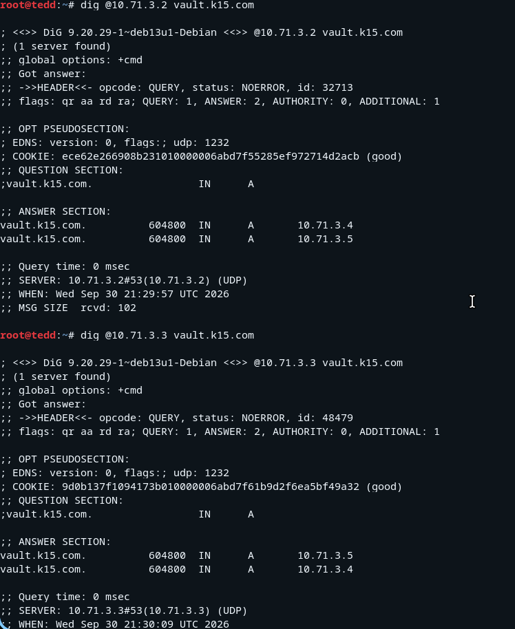
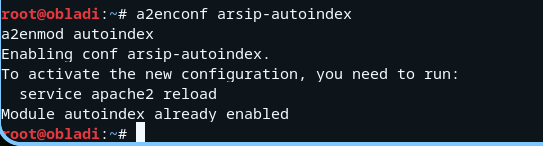
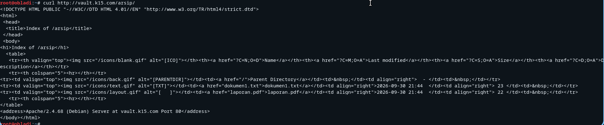
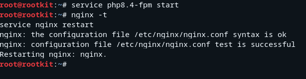
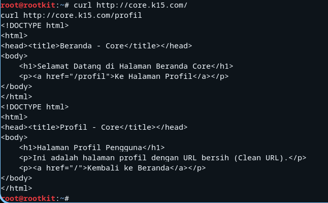
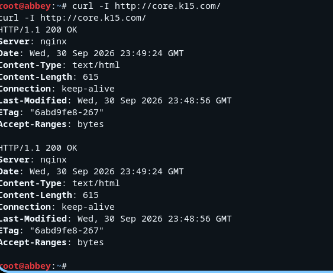
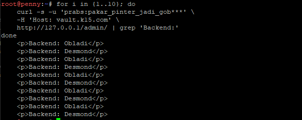

# Jarkom-Modul-2-2026-K-15


| Nama | NRP |
| ---  | --- |
| I Made Tobby Anantha Adiwijaya | 5027251064 |
| Rheza Pramudita Adi Putra | 5027251090 |

## Soal 1
Sebagai pusat kesadaran The Mesh, rootkit harus merentangkan koneksinya ke lima gerbang utama (Switch). Kita tetapkan alamat IP dan default gateway untuk seluruh entitas, mulai dari para operator (**alpha, beta, gamma**), penjaga directory (**prab, tedd**), gerbang penyaring (**abbey, penny**), hingga repository (**obladi, desmond, oblada, molly**).


Uji coba ping gateway lokal router:
```
ping -c 3 10.71.1.1
```

## Soal 2
Pada soal ini kita memastikan agar semua host di dalam jaringan dapat menjangkau internet publik menggunakan IP address. Dengan cara membuka jalur menuju NAT dengan memastikan antarmuka WAN di router rootkit aktif. Konfigurasikan pada node `rootkit` dengan menggunakan:
```
up sysctl -w net.ipv4.ip_forward=1
up iptables -t nat -A POSTROUTING -o eth0 -j MASQUERADE
```

Uji coba ping internet dengan menggunakan:
```
ping -c 3 8.8.8.8

ping -c 3 google.com
```

## Soal 3
Untuk menghindari fragmentasi saat persiapan, kita pastikan setiap host non-router menambahkan `resolver 192.168.122.1` pada setiap node tersebut. Konfigurasi yang digunakan ialah:
```
up echo "nameserver 192.168.122.1" > /etc/resolv.conf
```

Cara mengeceknya gunakan beberapa command ini di terminal node tersebut.
```
cat /etc/resolv.conf
# atau
nslookup google.com
```

## Soal 4
Soal kali ini adalah membuat sistem "Buku Telepon" internal (DNS Server) untuk jaringan The Mesh agar semua entitas bisa berkomunikasi menggunakan nama domain seperti `xxxx.com`, tidak lagi hanya bergantung pada IP Address.

Langkah pertama adalah set DNS Master di Node `prab`. Buka terminal di Node `prab` lalu pertama
```
apt-get update && apt-get install -y bind9 bind9utils
```
setelah selesai, edit file `/etc/bind/named.conf.options`
```
nano /etc/bind/named.conf.options
```
sesuaikan menjadi
```
options {
    directory "/var/cache/bind";

    forwarders {
        192.168.122.1;
    };

    allow-query { any; };
    auth-nxdomain no;
    listen-on-v6 { any; };
};
```
lalu `CTRL + O` untuk simpan dan `CTRL + X` untuk keluar. Setelah itu deklarasikan Master Zone di `/etc/bind/named.conf.local`
```
zone "<xxxx>.com" {
    type master;
    file "/etc/bind/jarkom/<xxxx>.com";
    allow-transfer { <IP_TEDD>; };
    notify yes;
};
```
ganti `<xxxx>`.com dengan nama kelompok dan `<IP_TEDD>` dengan IP milik node tedd. Setelah itu buat file database DNS Record, Buka file database zone baru di `prab`
```
mkdir -p /etc/bind/jarkom
nano /etc/bind/jarkom/<xxxx>.com
```
isi dengan kode berikut, ganti `<xxxx>`.com dengan nama kelompok, dan masukkan IP asli `prab`, `tedd`, dan `penny`
```
$TTL    604800
@       IN      SOA     prab.<xxxx>.com. root.<xxxx>.com. (
                          2026100101 ; Serial
                              604800 ; Refresh
                               86400 ; Retry
                             2419200 ; Expire
                              604800 ) ; Negative Cache TTL
;
; Record NS (Name Server)
@       IN      NS      prab.<xxxx>.com.
@       IN      NS      tedd.<xxxx>.com.

; Record A untuk Host
prab    IN      A       <IP_PRAB>
tedd    IN      A       <IP_TEDD>

; Record A Apex domain (@) mengarah ke penny
@       IN      A       <IP_PENNY>
```
simpan lalu keluar, lalu restart `BIND9` di prab
```
service bind9 restart
```
atau
```
service named restart
```
Selanjutnya pindah ke node `tedd`, install BIND9
```
apt-get update && apt-get install -y bind9 bind9utils
```
Edit file `/etc/bind/named.conf.options`
```
nano /etc/bind/named.conf.options
```
Atur isinya di bagian forwarders ke IP `NAT`
```
options {
    directory "/var/cache/bind";

    forwarders {
        192.168.122.1;
    };

    allow-query { any; };
};
```
simpan lalu keluar, lalu deklarasikan Slave Zone di `/etc/bind/named.conf.local`
```
nano /etc/bind/named.conf.local
```
Tambahkan blok zone slave ini di baris paling bawah
```
zone "<xxxx>.com" {
    type slave;
    masters { <IP_PRAB>; };
    file "/var/lib/bind/<xxxx>.com";
};
```
simpan lalu keluar, lalu restart service seperti tadi
```
service named restart
```
selanjutnya perbarui resolver di semua node non router. Jalankan perintah ini dengan file `soal_4_client.sh` di semua node selain `rootkit` (`alpha`, `beta`, `gamma`, `delta`, `epsilon`, `abbey`, `penny`, `obladi`, `desmond`, `oblada`, `molly`, serta `prab` & `tedd`)
```
cat <<EOF > /etc/resolv.conf
nameserver <IP_PRAB>
nameserver <IP_TEDD>
nameserver 192.168.122.1
EOF
```

Atau bisa juga dengan menambahkan langsung di configure network agar selalu menyala setiap node dijalankan dengan:
```
up echo "nameserver 10.71.3.2" > /etc/resolv.conf
up echo "nameserver 10.71.3.3" >> /etc/resolv.conf
up echo "nameserver 192.168.122.1" >> /etc/resolv.conf
```

uji hasilnya dengan
```
host k15.com
```
harus mengembalikan IP dari Penny
```
host prab.k15.com
host tedd.k15.com
```
Harus mengembalikan IP `prab` dan `tedd` masing-masing.


## Soal 5
Soal kali ini terdiri dari 2 bagian utama, `Hostname System-wide`: Setiap node (misalnya `alpha`) harus punya hostname sesuai namanya di sistem operasi (`/etc/hostname` dan `/etc/hosts`) dan `Subdomain DNS di BIND9`: Di server DNS (`prab`), buatkan Record A untuk semua node agar nama seperti alpha.k15.com, beta.k15.com, dst., bisa di-ping dan di-host dari client.

Aturan Pengecualian (prab & tedd): Subdomain prab.k15.com dan tedd.k15.com tidak perlu dibuat lagi di daftar record baru ini karena sudah dibuat sebelumnya pada Soal No. 4 sebagai Name Server.

Langkah pertamanya tambahkan record semua node di `prab`, buka terminal di node `prab` untuk mengedit file zone BIND9
```
nano /etc/bind/jarkom/k15.com
```
tambahkan record A berikut pada baris paling bawah (ganti `<IP>` dengan IP masing-masing)
```
; Record A untuk Seluruh Node
rootkit IN      A       <IP_ROOTKIT>
alpha   IN      A       <IP_ALPHA>
beta    IN      A       <IP_BETA>
gamma   IN      A       <IP_GAMMA>
delta   IN      A       <IP_DELTA>
epsilon IN      A       <IP_EPSILON>
abbey   IN      A       <IP_ABBEY>
penny   IN      A       <IP_PENNY>
obladi  IN      A       <IP_OBLADI>
desmond IN      A       <IP_DESMOND>
oblada  IN      A       <IP_OBLADA>
molly   IN      A       <IP_MOLLY>
```
Di bagian atas file zone, ubah Serial dari 2026100101 menjadi 2026100105 (supaya Node tedd mau melakukan sync/transfer zone otomatis), simpan lalu keluar. Cek syntax dan restart
```
named-checkzone k15.com /etc/bind/jarkom/k15.com
service named restart
```
Langkah kedua set hostname di masing-masing node kecuali `rootkid` seperti tadi, tujuannya agar saat berada di terminal node tersebut sistemnya tau siapa dirinya sendiri. Buka terminal masing-masing node lalu jalankan (jika manual)
```
hostname alpha && echo "alpha" > /etc/hostname
hostname beta && echo "beta" > /etc/hostname
hostname gamma && echo "gamma" > /etc/hostname
hostname delta && echo "delta" > /etc/hostname
hostname epsilon && echo "epsilon" > /etc/hostname
hostname abbey && echo "abbey" > /etc/hostname
hostname penny && echo "penny" > /etc/hostname
hostname obladi && echo "obladi" > /etc/hostname
hostname desmond && echo "desmond" > /etc/hostname
hostname oblada && echo "oblada" > /etc/hostname
hostname molly && echo "molly" > /etc/hostname
hostname prab && echo "prab" > /etc/hostname
hostname tedd && echo "tedd" > /etc/hostname
```

**ATAU**, kita juga bisa menambahkan langsung di configure network agar selalu menyala setiap node. Ditambahkannya itu setelah bagian `nameserver 192.168.122.1`.

router sentral rootkit:
```
up hostname rootkit && echo "rootkit" > /etc/hostname
up echo "127.0.1.1 rootkit" >> /etc/hosts
```

alpha:
```
up hostname alpha && echo "alpha" > /etc/hostname
up echo "127.0.1.1 alpha" >> /etc/hosts
```

beta:
```
up hostname beta && echo "beta" > /etc/hostname
up echo "127.0.1.1 beta" >> /etc/hosts
```

gamma:
```
up hostname gamma && echo "gamma" > /etc/hostname
up echo "127.0.1.1 gamma" >> /etc/hosts
```

abbey:
```
up hostname abbey && echo "abbey" > /etc/hostname
up echo "127.0.1.1 abbey" >> /etc/hosts
```

penny:
```
up hostname penny && echo "penny" > /etc/hostname
up echo "127.0.1.1 penny" >> /etc/hosts
```

delta:
```
up hostname delta && echo "delta" > /etc/hostname
up echo "127.0.1.1 delta" >> /etc/hosts
```

epsilon:
```
up hostname epsilon && echo "epsilon" > /etc/hostname
up echo "127.0.1.1 epsilon" >> /etc/hosts
```

prab:
```
up hostname prab && echo "prab" > /etc/hostname
up echo "127.0.1.1 prab" >> /etc/hosts
```

tedd:
```
up hostname tedd && echo "tedd" > /etc/hostname
up echo "127.0.1.1 tedd" >> /etc/hosts
```

obladi:
```
up hostname obladi && echo "obladi" > /etc/hostname
up echo "127.0.1.1 obladi" >> /etc/hosts
```

desmond:
```
up hostname desmond && echo "desmond" > /etc/hostname
up echo "127.0.1.1 desmond" >> /etc/hosts
```

oblada:
```
up hostname oblada && echo "oblada" > /etc/hostname
up echo "127.0.1.1 oblada" >> /etc/hosts
```

molly:
```
up hostname molly && echo "molly" > /etc/hostname
up echo "127.0.1.1 molly" >> /etc/hosts
```

Kemudian, execute script `soal_5_auto.sh` untuk memperbarui jika mengikuti langkah yang "up hostname..."

setelah itu ketik `hostname` di terminal node manapun dia bakal menjawab dirinya sendiri.


Uji subdomain node (misal dari alpha) dengan:
```
ping -c 2 beta.k15.com
host molly.k15.com
host penny.k15.com
```

## Soal 6
Soal kali ini verifikasi sinkronisasi otomatis antara DNS Master `prab` dan DNS Slave `tedd`.

Ketika memperbarui data DNS atau menaikkan angka Serial di `prab`, `prab` akan mengirimkan sinyal (NOTIFY) ke `tedd`. Kemudian `tedd` akan meminta salinan data zone terbaru melalui proses yang disebut Zone Transfer (AXFR/IXFR).

Zone Transfer Berjalan: Pastikan tedd berhasil menarik file zone dari prab tanpa ada permission error atau refused connection.

Serial SOA Identik: Angka Serial pada Record SOA di node tedd harus sama persis dengan angka Serial di prab (contoh: 2026100105).

Langkah pertama cek angka serial SOA di master `prab`, jalankan di terminal `prab`
```
dig @10.71.3.2 k15.com SOA +short
```
output yang keluar
```
prab.k15.com. root.k15.com. 2026100105 604800 86400 2419200 604800
```


selanjutnya cek angka serial SOA di slave `tedd`, jalankan di terminal `tedd`
```
dig @10.71.3.3 k15.com SOA +short
```
output yang keluar
```
prab.k15.com. root.k15.com. 2026100105 604800 86400 2419200 604800
```


Langkah ketiga memastikan file salinan zona benar-benar diterima dari prab, jalankan perintah berikut di terminal `tedd`
```
ls -l /var/lib/bind/k15.com
```
jika file belum dibentuk di direktori maka harus membuat dulu
```
mkdir -p /var/lib/bind
chown -R bind:bind /var/lib/bind
chmod 755 /var/lib/bind
```
lalu pastikan konfigurasi slave di /etc/bind/named.conf.local sudah benar menunjuk ke master `prab` (10.71.3.2)
```
cat <<EOF > /etc/bind/named.conf.local
zone "k15.com" {
    type slave;
    masters { 10.71.3.2; };
    file "/var/lib/bind/k15.com";
};
EOF
```
restart BIND9 di `prab` dan `tedd`
```
service named restart
```
verifikasi kembali
```
ls -l /var/lib/bind/k15.com
```


langkah terakhir verifikasi serial SOA jika kedua perintah tersebut memunculkan nomor serial yang sama persis (misalnya 2026100105), maka poin konfigurasi DNS Master-Slave ini sudah selesai.

`prab`
```
dig @10.71.3.2 k15.com SOA +short
```

`tedd`
```
dig @10.71.3.3 k15.com SOA +short
```


Alternatifnya, bisa tinggal mengeksekusi skrip `soal_6_prab.sh` dan `soal_6_tedd.sh`.

## Soal 7
Pada soal ini kita diminta untuk menambahkan  pada zona `k15.com` A record untuk `vault.k15.com` (IP obladi & desmond), dan `core.k15.com` (IP oblada & molly). Kita juga tetapkan CNAME:  
- `www.k15.com` → `penny.k15.com`
- `static.k15.com` → `abbey.k15.com`

Lalu kita akan verifikasi dari dua klien berbeda bahwa seluruh hostname tersebut ter-resolve ke tujuan yang benar dan konsisten.

Pada node `prab`, buka file database zona yang terletak di `/etc/bind/jarkom/k15.com`:
```
nano /etc/bind/jarkom/k15.com
```

WAJIB lakukan penambahan angka serial pada baris SOA:
```
(misal dari `2026100105` menjadi `2026100107`).
```

Hal ini wajib dilakukan agar BIND9 mengenali adanya pembaruan data dan mengirim sinyal NOTIFY ke server slave (`tedd`). Tambahkan juga Record A dan CNAME dengan tambahan baris berikut di bagian bawah file:
```
; Soal 7: A Record vault (obladi & desmond) - DNS Round Robin
vault   IN      A       10.71.3.4
vault   IN      A       10.71.3.5

; Soal 7: A Record core (oblada & molly) - DNS Round Robin
core    IN      A       10.71.3.6
core    IN      A       10.71.3.7

; Soal 7: CNAME Records
www     IN      CNAME   penny.k15.com.
static  IN      CNAME   abbey.k15.com.
```

Simpan file dengan menekan `Ctrl + O` lalu tekan `Enter`, kemudian keluar menggunakan `Ctrl + X`.

Kemudian kita restart layanan di `prab`. Sebelum merestart layanan, periksa apakah ada kesalahan sintaks atau format penulisan:
```
named-checkzone k15.com /etc/bind/jarkom/k15.com
```

Jika sudah valid (OK), jalankan:
```
service named restart
```

Setelah itu, sinkronisasi di terminal node `tedd` (Slave DNS).
```
service named restart
sleep 2
dig @10.71.3.3 k15.com SOA +short
```
  
Pastikan nomor serial yang keluar sudah sama (`2026100107`).

Verifikasi dari Klien 1 (`alpha`):
```
# 1. Tes vault.k15.com (harus merespons IP obladi & desmond)
host vault.k15.com

# 2. Tes core.k15.com (harus merespons IP oblada & molly)
host core.k15.com

# 3. Tes CNAME www.k15.com (alias ke penny.k15.com -> 10.71.4.2)
host www.k15.com

# 4. Tes CNAME static.k15.com (alias ke abbey.k15.com -> 10.71.2.2)
host static.k15.com
```


Verifikasi dari Klien 2 (`delta`)
```
host vault.k15.com
host core.k15.com
host www.k15.com
host static.k15.com
```


Hasilnya, node `delta` memberikan jawaban yang konsisten dan mengembalikan pasangan IP serta alias yang sama seperti pada node `alpha`.

## Soal 8
Soal kali ini membuat reverse DNS (PTR Record). Jika sebelumnya kita melakukan Forward Lookup (mencari IP berdasarkan nama domain, contoh: vault.k15.com $\rightarrow$ IP), maka Reverse DNS adalah kebalikannya: mencari nama hostname berdasarkan IP address (contoh: IP 10.71.2.2 $\rightarrow$ abbey.k15.com).

Langkah pertama pastikan direktori penyimpanan file zona di `prab` benar-benar ada
```
mkdir -p /etc/bind/jarkom
```
Buka file konfigurasi lokal BIND9 di prab
```
nano /etc/bind/named.conf.local
```
isi dengan konfigurasi master untuk domain utama (k15.com) dan ketiga reverse zone berikut
```
zone "k15.com" {
    type master;
    file "/etc/bind/jarkom/k15.com";
    allow-transfer { 10.71.3.3; };
};

zone "2.71.10.in-addr.arpa" {
    type master;
    file "/etc/bind/jarkom/2.71.10.rev";
    allow-transfer { 10.71.3.3; };
};

zone "4.71.10.in-addr.arpa" {
    type master;
    file "/etc/bind/jarkom/4.71.10.rev";
    allow-transfer { 10.71.3.3; };
};

zone "3.71.10.in-addr.arpa" {
    type master;
    file "/etc/bind/jarkom/3.71.10.rev";
    allow-transfer { 10.71.3.3; };
};
```
Buat File Zona Utama & Reverse di `prab`

File zona utama (k15.com)
```
cat <<EOF > /etc/bind/jarkom/k15.com
\$TTL    604800
@       IN      SOA     prab.k15.com. root.k15.com. (
                          2026100101 ; Serial
                              604800 ; Refresh
                               86400 ; Retry
                             2419200 ; Expire
                              604800 ) ; Negative Cache TTL
;
@       IN      NS      prab.k15.com.
@       IN      NS      tedd.k15.com.

prab    IN      A       10.71.3.2
tedd    IN      A       10.71.3.3
abbey   IN      A       10.71.2.2
penny   IN      A       10.71.4.2

vault   IN      A       10.71.3.4
vault   IN      A       10.71.3.5

core    IN      A       10.71.3.6
core    IN      A       10.71.3.7

www     IN      CNAME   penny.k15.com.
static  IN      CNAME   abbey.k15.com.
EOF
```
File Reverse Zone 2.71.10.rev (Subnet Abbey - 10.71.2.2)
```
cat <<EOF > /etc/bind/jarkom/2.71.10.rev
\$TTL    604800
@       IN      SOA     prab.k15.com. root.k15.com. (
                          2026100101 ; Serial
                              604800 ; Refresh
                               86400 ; Retry
                             2419200 ; Expire
                              604800 ) ; Negative Cache TTL
;
@       IN      NS      prab.k15.com.
@       IN      NS      tedd.k15.com.

2       IN      PTR     abbey.k15.com.
EOF
```
File Reverse Zone 4.71.10.rev (Subnet Penny - 10.71.4.2)
```
cat <<EOF > /etc/bind/jarkom/4.71.10.rev
\$TTL    604800
@       IN      SOA     prab.k15.com. root.k15.com. (
                          2026100101 ; Serial
                              604800 ; Refresh
                               86400 ; Retry
                             2419200 ; Expire
                              604800 ) ; Negative Cache TTL
;
@       IN      NS      prab.k15.com.
@       IN      NS      tedd.k15.com.

2       IN      PTR     penny.k15.com.
EOF
```
File Reverse Zone 3.71.10.rev (Subnet Vault & Core - 10.71.3.x)
```
cat <<EOF > /etc/bind/jarkom/3.71.10.rev
\$TTL    604800
@       IN      SOA     prab.k15.com. root.k15.com. (
                          2026100101 ; Serial
                              604800 ; Refresh
                               86400 ; Retry
                             2419200 ; Expire
                              604800 ) ; Negative Cache TTL
;
@       IN      NS      prab.k15.com.
@       IN      NS      tedd.k15.com.

2       IN      PTR     prab.k15.com.
3       IN      PTR     tedd.k15.com.
4       IN      PTR     obladi.k15.com.
5       IN      PTR     desmond.k15.com.
6       IN      PTR     oblada.k15.com.
7       IN      PTR     molly.k15.com.
EOF
```
Sekarang coba jalankan BIND9 di `prab` dengan perintah
```
/usr/sbin/named
```
Kalau keluar prompt kosong seperti itu setelah menjalankan /usr/sbin/named, artinya daemon BIND9 berhasil jalan dengan sukses tanpa ada error fatal yang menghentikannya.

Langkah selanjutnya setup node slave `tedd`, pindah ke terminal tedd untuk menyelesaikan konfigurasi bagian slave-nya.

Buka terminal `tedd` dan pastikan foldernya ada
```
mkdir -p /etc/bind
```
Edit file konfigurasi lokal di `tedd`
```
nano /etc/bind/named.conf.local
```
Masukkan konfigurasi Slave untuk reverse zone (dan domain utama jika diperlukan)
```
zone "k15.com" {
    type slave;
    masters { 10.71.3.2; };
    file "/var/lib/bind/k15.com";
};

zone "2.71.10.in-addr.arpa" {
    type slave;
    masters { 10.71.3.2; };
    file "/var/lib/bind/2.71.10.rev";
};

zone "4.71.10.in-addr.arpa" {
    type slave;
    masters { 10.71.3.2; };
    file "/var/lib/bind/4.71.10.rev";
};

zone "3.71.10.in-addr.arpa" {
    type slave;
    masters { 10.71.3.2; };
    file "/var/lib/bind/3.71.10.rev";
};
```
jalankan
```
/usr/sbin/named
```
oh iya jika tidak bisa menjalankan itu maka harus install BIND9 dulu ya
```
apt-get update && apt-get install bind9 bind9utils -y
```
Sekarang kedua node (prab sebagai master dan tedd sebagai slave) sudah aktif menjalankan DNS server.

Untuk memastikan semuanya berjalan lancar dan zona dari master berhasil melakukan zone transfer ke slave, kita bisa melakukan pengujian menggunakan perintah dig atau nslookup dari salah satu node atau client.

Pengujian ini bisa kita jalankan di terminal mana saja (misalnya langsung dari terminal prab, tedd, atau client lain yang terhubung ke jaringan tersebut), cukup mengetikkan perintah dig untuk menguji query langsung ke IP Master (10.71.3.2) dan IP Slave (10.71.3.3)
```
dig @10.71.3.2 vault.k15.com
dig @10.71.3.3 vault.k15.com
```


## Soal 9
Soal kali ini diminta untuk mengonfigurasi web server Apache di node vault agar bisa diakses menggunakan hostname (seperti vault.k15.com), bukan alamat IP-nya secara langsung.

Selain itu, di dalam web server tersebut harus ada folder /arsip/ yang fitur autoindex (directory listing)-nya diaktifkan, sehingga kalau folder itu dibuka lewat browser, daftar file yang ada di dalamnya akan otomatis tampil berbentuk daftar/tabel direktori yang bisa diklik dan ditelusuri.

Langkah pertama masuk ke node `vault` dan install apache, masuk ke terminal `obladi` lalu jalankan
```
apt-get update && apt-get install apache2 -y
```
Buat direktori /arsip/ dan isi beberapa file contoh
```
mkdir -p /var/www/html/arsip
echo "File arsip 1 di obladi" > /var/www/html/arsip/dokumen1.txt
echo "Laporan penting vault" > /var/www/html/arsip/laporan.pdf
```
Aktifkan fitur Autoindex (Directory Listing), buat file konfigurasi direktori untuk Apache
```
cat <<EOF > /etc/apache2/conf-available/arsip-autoindex.conf
<Directory /var/www/html/arsip>
    Options Indexes FollowSymLinks
    AllowOverride None
    Require all granted
</Directory>
EOF
```
aktifkan konfigurasi dan modulnya
```
a2enconf arsip-autoindex
a2enmod autoindex
```



Sesuai dengan saran di terminal, sekarang jalankan perintah untuk memuat ulang konfigurasi Apache
```
service apache2 reload
```
Pastikan juga layanan Apache-nya sudah aktif dan berjalan (jika belum, jalankan `service apache2 start`)

Setelah itu, kamu bisa langsung melakukan pengujian dari terminal klien menggunakan hostname vault.k15.com
```
curl http://vault.k15.com/arsip/
```
```
curl http://vault.k15.com/arsip/dokumen1.txt
```



## Soal 10
Soal kali ini kita diminta untuk membangun layanan web dinamis menggunakan Nginx dan PHP-FPM pada node *core* yang nantinya diakses melalui hostname seperti `core.k15.com`. Di dalam server tersebut, kita perlu membuat aplikasi PHP sederhana yang mencakup halaman beranda serta halaman profil. Selain itu, kita juga harus menerapkan aturan *rewrite* pada konfigurasi Nginx agar URL dapat diakses secara bersih tanpa ekstensi file; contohnya ketika pengguna mengakses `[core.k15.com/profil](https://core.k15.com/profil)`, server secara *backend* akan mengarahkannya ke file `profil.php` tanpa menampilkan ekstensi `.php` di bilah alamat *browser*. Terakhir, seluruh proses pengujian ini wajib dilakukan menggunakan hostname yang telah ditentukan, bukan melalui alamat IP langsung.

Langkah pertama install Nginx dan PHP-FPM, masuk ke terminal node core `oblada` dan `molly`, lalu jalankan perintah berikut untuk menginstal Nginx serta PHP-FPM
```
apt-get update && apt-get install nginx php-fpm -y
```
selanjutnya buat aplikasi PHP sederhana, buat direktori web root untuk aplikasi core, lalu buat file index.php (beranda) dan profil.php (profil).

Buat foldernya
```
mkdir -p /var/www/html/core
```
buat halaman beranda
```
cat <<EOF > /var/www/html/core/index.php
<!DOCTYPE html>
<html>
<head><title>Beranda - Core</title></head>
<body>
    <h1>Selamat Datang di Halaman Beranda Core</h1>
    <p><a href="/profil">Ke Halaman Profil</a></p>
</body>
</html>
EOF
```
buat halaman profil
```
cat <<EOF > /var/www/html/core/profil.php
<!DOCTYPE html>
<html>
<head><title>Profil - Core</title></head>
<body>
    <h1>Halaman Profil Pengguna</h1>
    <p>Ini adalah halaman profil dengan URL bersih (Clean URL).</p>
    <p><a href="/">Kembali ke Beranda</a></p>
</body>
</html>
EOF
```
selanjutnya konfigurasi Nginx dan aturan URL rewrite, Kita perlu mengatur Nginx agar mengenali PHP-FPM dan menerapkan aturan rewrite agar /profil dapat membuka profil.php secara transparan tanpa menampilkan ekstensinya.

Buat file konfigurasi baru untuk server block Nginx
```
nano /etc/nginx/sites-available/core.conf
```
Masukkan konfigurasi berikut (sesuaikan socket PHP-FPM, misal php8.2-fpm.sock atau php-fpm.sock)
```
server {
    listen 80;
    server_name core.k15.com;
    root /var/www/html/core;
    index index.php index.html index.htm;

    location / {
        try_files $uri $uri/ @extensionless;
    }

    # Aturan rewrite untuk URL bersih tanpa .php
    location @extensionless {
        rewrite ^(.*)$ $1.php last;
    }

    location ~ \.php$ {
        include snippets/fastcgi-php.conf;
        # Sesuaikan path socket php-fpm di bawah ini dengan sistem Anda
        fastcgi_pass unix:/var/run/php/php8.4-fpm.sock; 
        fastcgi_param SCRIPT_FILENAME $document_root$fastcgi_script_name;
        include fastcgi_params;
    }
}
```
Aktifkan konfigurasi dengan membuat symlink ke sites-enabled dan hapus default config jika perlu
```
ln -s /etc/nginx/sites-available/core.conf /etc/nginx/sites-enabled/
rm -f /etc/nginx/sites-enabled/default
```
jalankan dan restart layanan, pastikan PHP-FPM dan Nginx berjalan dengan normal
```
service php8.4-fpm start
# Atau sesuaikan nama layanan php-fpm Anda (misal: service php-fpm start)

nginx -t
service nginx restart
```



Sekarang, saatnya melakukan pengujian akhir sesuai ketentuan soal (wajib menggunakan hostname, bukan IP address)

```
curl http://core.k15.com/
curl http://core.k15.com/profil
```
kalau tidak bisa coba mapping manual ke file /etc/hosts di node `rootkit` agar langsung menembak ke dirinya sendiri
```
echo "127.0.0.1 core.k15.com" >> /etc/hosts
```
coba ulangi lagi
```
curl http://core.k15.com/
curl http://core.k15.com/profil
```



## Soal 11
Sekarang kita diminta untuk mengonfigurasi dua node khusus sebagai reverse proxy yang bertindak sebagai gerbang depan untuk menerima dan meneruskan permintaan ke server backend di belakangnya. Node `Penny` yang menggunakan Apache dikonfigurasi sebagai reverse proxy untuk mendistribusikan lalu lintas ke area vault yang mencakup node `Obladi` dan `Desmond`, sementara node `Abbey` yang menggunakan Nginx bertugas meneruskan lalu lintas ke area core yang mencakup `Oblada` dan `Molly`.

Selain berfungsi sebagai pengatur rute dan load balancer, kedua gerbang ini wajib meneruskan identitas asli pengunjung dengan cara meneruskan header Host dan X-Real-IP. Hal ini penting agar server backend di belakangnya dapat mengenali alamat IP asli klien yang mengakses alih-alih hanya mendeteksi alamat IP dari proxy itu sendiri.

Terakhir, kita perlu melakukan pembuktian untuk memastikan bahwa `Penny` dan `Abbey` benar-benar bekerja secara optimal. Pembuktian ini biasanya dilakukan dengan mengirimkan perintah curl secara berulang ke domain proxy terkait, kemudian memeriksa access log pada masing-masing server backend guna memvalidasi bahwa lalu lintas berhasil terdistribusi secara merata dan header pengenal aslinya diteruskan dengan tepat.

Langkah pertama konfigurasi `Penny` (Apache Reverse Proxy ke Vault), Masuk ke node `Penny`, lalu siapkan modul dan konfigurasi Apache.

Install dan Aktifkan Modul Proxy Apache, jalankan di terminal `Penny`
```
apt update && apt install -y apache2
a2enmod proxy proxy_http proxy_balancer lbmethod_byrequests headers
```
Buat file konfigurasi baru untuk reverse proxy vault
```
nano /etc/apache2/sites-available/vault-proxy.conf
```
Masukkan konfigurasi berikut (sesuaikan <IP_OBLADI> dan <IP_DESMOND> dengan alamat IP yang sesuai)
```
<VirtualHost *:80>
    ServerName vault.k15.com

    # Meneruskan identitas asli pengunjung
    ProxyPreserveHost On
    RequestHeader set X-Real-IP "%{REMOTE_ADDR}s"

    # Load balancing ke Obladi dan Desmond
    <Proxy balancer://vaultcluster>
        BalancerMember http://<IP_OBLADI>
        BalancerMember http://<IP_DESMOND>
        ProxySet lbmethod=byrequests
    </Proxy>

    ProxyPass / balancer://vaultcluster/
    ProxyPassReverse / balancer://vaultcluster/
</VirtualHost>
```
Simpan file tersebut, lalu aktifkan konfigurasi dan restart layanan Apache
```
service apache2 restart
```
sekarang beralih ke node `abbey` untuk mengonfigurasinya sebagai reverse proxy Nginx menuju area core (`Oblada` & `Molly`). Masuk ke terminal `abbey` lalu install nginx jika belum ada
```
apt update && apt install -y nginx
```
Buat file konfigurasi proxy baru
```
nano /etc/nginx/sites-available/core-proxy.conf
```
Masukkan konfigurasi berikut (sesuaikan <IP_OBLADA> dan <IP_MOLLY> dengan IP backend yang bersangkutan)
```
upstream core_cluster {
    server <IP_OBLADA>;
    server <IP_MOLLY>;
}

server {
    listen 80;
    server_name core.k15.com;

    location / {
        proxy_pass http://core_cluster;

        # Meneruskan header Host dan X-Real-IP sesuai ketentuan
        proxy_set_header Host $host;
        proxy_set_header X-Real-IP $remote_addr;
        proxy_set_header X-Forwarded-For $proxy_add_x_forwarded_for;
    }
}
```
Aktifkan konfigurasi dan restart Nginx
```
ln -s /etc/nginx/sites-available/core-proxy.conf /etc/nginx/sites-enabled/
rm -f /etc/nginx/sites-enabled/default
nginx -t
service nginx restart
```
Sekarang kita masuk ke tahap pembuktian (testing) untuk memastikan `Penny` dan `Abbey` berhasil mendistribusikan lalu lintas ke backend serta meneruskan header identitas asli dengan tepat.

Lakukan perintah curl berulang kali ke arah reverse proxy `Penny` dan `Abbey` (pastikan domainnya sudah disesuaikan atau diarahkan ke IP proxy di /etc/hosts jika diperlukan)
```
# Menguji load balancing ke area Vault melalui Penny
curl -I http://vault.k15.com/
curl -I http://vault.k15.com/

# Menguji load balancing ke area Core melalui Abbey
curl -I http://core.k15.com/
curl -I http://core.k15.com/
```



oiya pastikan layanan web server `oblada` dan `molly` aktif pada port 80.

## Soal 12
Sekarang kita diminta untuk mengamankan direktori atau path /admin pada server Penny menggunakan fitur HTTP Basic Authentication.

Artinya, siapa pun yang mencoba mengakses `[http://vault.k15.com/admin](http://vault.k15.com/admin)` (atau IP `Penny` bagian vault) melalui browser atau perintah curl akan ditolak dan diminta memasukkan username dan password terlebih dahulu. Akses hanya akan diberikan jika memasukkan kombinasi kredensial yang tepat.

Masuk ke terminal Penny, lalu pastikan tools utilitas Apache untuk enkripsi password sudah terinstal
```
apt update && apt install -y apache2-utils
```
Buat file penyimpanan password (misalnya di /etc/apache2/.htpasswd) dan masukkan username `prabs`
```
htpasswd -c /etc/apache2/.htpasswd prabs
```
Saat perintah ini dijalankan, terminal akan meminta kamu mengetikkan password. Masukkan password sesuai soal yaitu pakar_pinter_jadi_gob*** (teks password tidak akan nampak saat diketik demi keamanan, cukup ketik lalu tekan Enter).

Kemudian cek:
```
cat /etc/apache2/.htpasswd
```


Masih di terminal penny, buka file konfigurasi VirtualHost Penny (biasanya terletak di /etc/apache2/sites-available/vault-proxy.conf atau file konfigurasi default yang kamu gunakan), lalu tambahkan blok <Location /admin> di dalamnya
```
nano /etc/apache2/sites-available/vault-proxy.conf
```
```
<VirtualHost *:80>

    ServerName vault.k15.com

    # Meneruskan identitas asli pengunjung
    ProxyPreserveHost On
    RequestHeader set X-Real-IP "%{REMOTE_ADDR}s"

    # Load balancing ke Obladi dan Desmond
    <Proxy "balancer://vaultcluster">
        BalancerMember http://10.71.3.4:80
        BalancerMember http://10.71.3.5:80
        ProxySet lbmethod=byrequests
    </Proxy>

    ProxyPass / balancer://vaultcluster/
    ProxyPassReverse / balancer://vaultcluster/

    # Basic Authentication untuk /admin (BAGIAN INI YANG DITAMBAH)
    <Location "/admin">
        AuthType Basic
        AuthName "Area Rahasia Sindikat"
        AuthUserFile /etc/apache2/.htpasswd
        Require valid-user
    </Location>

</VirtualHost>
```

Lalu, aktifkan modul autentikasi dasar Apache di terminal `penny`:
```
a2enmod auth_basic
a2enmod authn_file
```

Setelah itu, periksa integritas berkas konfigurasi sebelum menerapkan perubahan di `penny`:
```
apache2ctl configtest
```

Jika sudah OK, restart di terminal `penny`:
```
service apache2 restart
```

Kemudian, masuk ke terminal `obladi` dan buat folder `/admin` beserta `index.html` dan isinya.
```
mkdir -p /var/www/html/admin
```
```
/var/www/html/admin/index.html
```
```
cat << 'EOF' > /var/www/html/admin/index.html
<!DOCTYPE html>
<html lang="id">
<head>
    <meta charset="UTF-8">
    <title>Vault Admin - Obladi</title>
</head>
<body>
    <h1>Admin Area</h1>
    <p>Backend: Obladi</p>
    <p>Hostname: obladi</p>
</body>
</html>
EOF
```

Lakukan yang mirip untuk terminal `desmond`.
```
mkdir -p /var/www/html/admin
```
```
/var/www/html/admin/index.html
```
```
cat << 'EOF' > /var/www/html/admin/index.html
<!DOCTYPE html>
<html lang="id">
<head>
    <meta charset="UTF-8">
    <title>Vault Admin - Desmond</title>
</head>
<body>
    <h1>Admin Area</h1>
    <p>Backend: Desmond</p>
    <p>Hostname: desmond</p>
</body>
</html>
EOF
```

Cek di terminal manapun untuk memastikan sudah OK:
```
curl -i http://127.0.0.1/admin/
```


Sekarang saatnya kita testing basic authentication. Masuk ke terminal `penny`.  
Tanpa password:
```
curl -i -H 'Host: vault.k15.com' \
http://127.0.0.1/admin/
```

Password salah:
```
curl -i -u 'prabs:salah' \
-H 'Host: vault.k15.com' \
http://127.0.0.1/admin/
```

Username salah:
```
curl -i -u 'salah:pakar_pinter_jadi_gob***' \
-H 'Host: vault.k15.com' \
http://127.0.0.1/admin/
```
Dari ketiga command di atas, seharusnya mengeluarkan output berupa `HTTP/1.1 401 Unauthorized`.

Credential benar:
```
curl -i -u 'prabs:pakar_pinter_jadi_gob***' \
-H 'Host: vault.k15.com' \
http://127.0.0.1/admin/
```


Pembuktian load balancing:
```
for i in {1..10}; do
    curl -s \
    -u 'prabs:pakar_pinter_jadi_gob***' \
    -H 'Host: vault.k15.com' \
    http://127.0.0.1/admin/ | grep 'Backend:'
done
```


## Soal 13