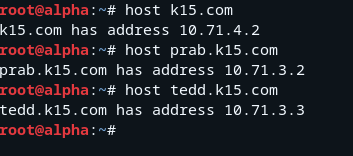
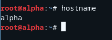
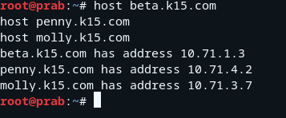
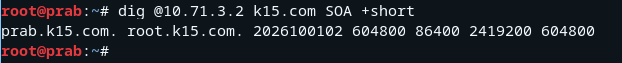
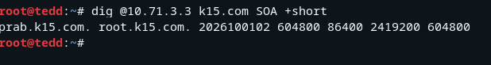
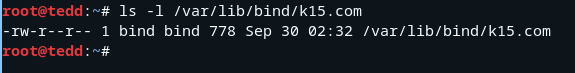
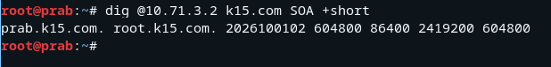
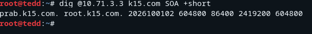

# Jarkom-Modul-2-2026-K-15


| Nama | NRP |
| ---  | --- |
| I Made Tobby Anantha Adiwijaya | 5027251064 |
| Rheza Pramudita Adi Putra | 5027251090 |

## Soal 1
Sebagai pusat kesadaran The Mesh, rootkit harus merentangkan koneksinya ke lima gerbang utama (Switch). Kita tetapkan alamat IP dan default gateway untuk seluruh entitas, mulai dari para operator (**alpha, beta, gamma**), penjaga directory (**prab, tedd**), gerbang penyaring (**abbey, penny**), hingga repository (**obladi, desmond, oblada, molly**).


Uji coba ping gateway lokal router:
```
ping -c 3 10.71.1.1
```

## Soal 2
Pada soal ini kita memastikan agar semua host di dalam jaringan dapat menjangkau internet publik menggunakan IP address. Dengan cara membuka jalur menuju NAT dengan memastikan antarmuka WAN di router rootkit aktif. Konfigurasikan pada node `rootkit` dengan menggunakan:
```
up sysctl -w net.ipv4.ip_forward=1
up iptables -t nat -A POSTROUTING -o eth0 -j MASQUERADE
```

Uji coba ping internet dengan menggunakan:
```
ping -c 3 8.8.8.8

ping -c 3 google.com
```

## Soal 3
Untuk menghindari fragmentasi saat persiapan, kita pastikan setiap host non-router menambahkan `resolver 192.168.122.1` pada setiap node tersebut. Konfigurasi yang digunakan ialah:
```
up echo "nameserver 192.168.122.1" > /etc/resolv.conf
```

Cara mengeceknya gunakan beberapa command ini di terminal node tersebut.
```
cat /etc/resolv.conf
# atau
nslookup google.com
```

## Soal 4
Soal kali ini adalah membuat sistem "Buku Telepon" internal (DNS Server) untuk jaringan The Mesh agar semua entitas bisa berkomunikasi menggunakan nama domain seperti `xxxx.com`, tidak lagi hanya bergantung pada IP Address.

Langkah pertama adalah set DNS Master di Node `prab`. Buka terminal di Node `prab` lalu pertama
```
apt-get update && apt-get install -y bind9 bind9utils
```
setelah selesai, edit file `/etc/bind/named.conf.options`
```
nano /etc/bind/named.conf.options
```
sesuaikan menjadi
```
options {
    directory "/var/cache/bind";

    forwarders {
        192.168.122.1;
    };

    allow-query { any; };
    auth-nxdomain no;
    listen-on-v6 { any; };
};
```
lalu `CTRL + O` untuk simpan dan `CTRL + X` untuk keluar. Setelah itu deklarasikan Master Zone di `/etc/bind/named.conf.local`
```
zone "<xxxx>.com" {
    type master;
    file "/etc/bind/jarkom/<xxxx>.com";
    allow-transfer { <IP_TEDD>; };
    notify yes;
};
```
ganti `<xxxx>`.com dengan nama kelompok dan `<IP_TEDD>` dengan IP milik node tedd. Setelah itu buat file database DNS Record, Buka file database zone baru di `prab`
```
mkdir -p /etc/bind/jarkom
nano /etc/bind/jarkom/<xxxx>.com
```
isi dengan kode berikut, ganti `<xxxx>`.com dengan nama kelompok, dan masukkan IP asli `prab`, `tedd`, dan `penny`
```
$TTL    604800
@       IN      SOA     prab.<xxxx>.com. root.<xxxx>.com. (
                          2026100101 ; Serial
                              604800 ; Refresh
                               86400 ; Retry
                             2419200 ; Expire
                              604800 ) ; Negative Cache TTL
;
; Record NS (Name Server)
@       IN      NS      prab.<xxxx>.com.
@       IN      NS      tedd.<xxxx>.com.

; Record A untuk Host
prab    IN      A       <IP_PRAB>
tedd    IN      A       <IP_TEDD>

; Record A Apex domain (@) mengarah ke penny
@       IN      A       <IP_PENNY>
```
simpan lalu keluar, lalu restart `BIND9` di prab
```
service bind9 restart
```
atau
```
service named restart
```
Selanjutnya pindah ke node `tedd`, install BIND9
```
apt-get update && apt-get install -y bind9 bind9utils
```
Edit file `/etc/bind/named.conf.options`
```
nano /etc/bind/named.conf.options
```
Atur isinya di bagian forwarders ke IP `NAT`
```
options {
    directory "/var/cache/bind";

    forwarders {
        192.168.122.1;
    };

    allow-query { any; };
};
```
simpan lalu keluar, lalu deklarasikan Slave Zone di `/etc/bind/named.conf.local`
```
nano /etc/bind/named.conf.local
```
Tambahkan blok zone slave ini di baris paling bawah
```
zone "<xxxx>.com" {
    type slave;
    masters { <IP_PRAB>; };
    file "/var/lib/bind/<xxxx>.com";
};
```
simpan lalu keluar, lalu restart service seperti tadi
```
service named restart
```
selanjutnya perbarui resolver di semua node non router. Jalankan perintah ini dengan file `soal_4_client.sh` di semua node selain `rootkit` (`alpha`, `beta`, `gamma`, `delta`, `epsilon`, `abbey`, `penny`, `obladi`, `desmond`, `oblada`, `molly`, serta `prab` & `tedd`)
```
cat <<EOF > /etc/resolv.conf
nameserver <IP_PRAB>
nameserver <IP_TEDD>
nameserver 192.168.122.1
EOF
```

Atau bisa juga dengan menambahkan langsung di configure network agar selalu menyala setiap node dijalankan dengan:
```
up echo "nameserver 10.71.3.2" > /etc/resolv.conf
up echo "nameserver 10.71.3.3" >> /etc/resolv.conf
up echo "nameserver 192.168.122.1" >> /etc/resolv.conf
```

uji hasilnya dengan
```
host k15.com
```
harus mengembalikan IP dari Penny
```
host prab.k15.com
host tedd.k15.com
```
Harus mengembalikan IP `prab` dan `tedd` masing-masing.



## Soal 5
Soal kali ini terdiri dari 2 bagian utama, `Hostname System-wide`: Setiap node (misalnya `alpha`) harus punya hostname sesuai namanya di sistem operasi (`/etc/hostname` dan `/etc/hosts`) dan `Subdomain DNS di BIND9`: Di server DNS (`prab`), buatkan Record A untuk semua node agar nama seperti alpha.k15.com, beta.k15.com, dst., bisa di-ping dan di-host dari client.

Aturan Pengecualian (prab & tedd): Subdomain prab.k15.com dan tedd.k15.com tidak perlu dibuat lagi di daftar record baru ini karena sudah dibuat sebelumnya pada Soal No. 4 sebagai Name Server.

Langkah pertamanya tambahkan record semua node di `prab`, buka terminal di nodde `prab` untuk mengedit file zone BIND9
```
nano /etc/bind/jarkom/k15.com
```
tambahkan record A berikut pada baris paling bawah (ganti `<IP>` dengan IP masing-masing)
```
; Record A untuk Seluruh Node
rootkit IN      A       <IP_ROOTKIT>
alpha   IN      A       <IP_ALPHA>
beta    IN      A       <IP_BETA>
gamma   IN      A       <IP_GAMMA>
delta   IN      A       <IP_DELTA>
epsilon IN      A       <IP_EPSILON>
abbey   IN      A       <IP_ABBEY>
penny   IN      A       <IP_PENNY>
obladi  IN      A       <IP_OBLADI>
desmond IN      A       <IP_DESMOND>
oblada  IN      A       <IP_OBLADA>
molly   IN      A       <IP_MOLLY>
```
Di bagian atas file zone, ubah Serial dari 2026100101 menjadi 2026100102 (supaya Node tedd mau melakukan sync/transfer zone otomatis), simpan lalu keluar. Cek syntax dan restart
```
named-checkzone k15.com /etc/bind/jarkom/k15.com
service named restart
```
Langkah kedua set hostname di masing-masing node kecuali `rootkid` seperti tadi, tujuannya agar saat berada di terminal node tersebut sistemnya tau siapa dirinya sendiri. Buka terminal masing-masing node lalu jalankan
```
hostname alpha && echo "alpha" > /etc/hostname
hostname beta && echo "beta" > /etc/hostname
hostname gamma && echo "gamma" > /etc/hostname
hostname delta && echo "delta" > /etc/hostname
hostname epsilon && echo "epsilon" > /etc/hostname
hostname abbey && echo "abbey" > /etc/hostname
hostname penny && echo "penny" > /etc/hostname
hostname obladi && echo "obladi" > /etc/hostname
hostname desmond && echo "desmond" > /etc/hostname
hostname oblada && echo "oblada" > /etc/hostname
hostname molly && echo "molly" > /etc/hostname
hostname prab && echo "prab" > /etc/hostname
hostname tedd && echo "tedd" > /etc/hostname
```
setelah itu ketik `hostname` di terminal node manapun dia bakal menjawab dirinya sendiri.





## Soal 6
Soal kali ini verifikasi sinkronisasi otomatis antara DNS Master `prab` dan DNS Slave `tedd`.

Ketika memperbarui data DNS atau menaikkan angka Serial di `prab`, `prab` akan mengirimkan sinyal (NOTIFY) ke `tedd`. Kemudian `tedd` akan meminta salinan data zone terbaru melalui proses yang disebut Zone Transfer (AXFR/IXFR).

Zone Transfer Berjalan: Pastikan tedd berhasil menarik file zone dari prab tanpa ada permission error atau refused connection.

Serial SOA Identik: Angka Serial pada Record SOA di node tedd harus sama persis dengan angka Serial di prab (contoh: 2026100105).

Langkah pertama cek angka serial SOA di master `prab`, jalankan di terminal `prab`
```
dig @10.71.3.2 k15.com SOA +short
```
output yang keluar
```
prab.k15.com. root.k15.com. 2026100105 604800 86400 2419200 604800
```



selanjutnya cek angka serial SOA di slave `tedd`, jalankan di terminal `tedd`
```
dig @10.71.3.3 k15.com SOA +short
```
output yang keluar
```
prab.k15.com. root.k15.com. 2026100105 604800 86400 2419200 604800
```



Langkah ketiga memastikan file salinan zona benar-benar diterima dari prab, jalankan perintah berikut di terminal `tedd`
```
ls -l /var/lib/bind/k15.com
```
jika file belum dibentuk di direktori maka harus membuat dulu
```
mkdir -p /var/lib/bind
chown -R bind:bind /var/lib/bind
chmod 755 /var/lib/bind
```
lalu pastikan konfigurasi slave di /etc/bind/named.conf.local sudah benar menunjuk ke master `prab` (10.71.3.2)
```
cat <<EOF > /etc/bind/named.conf.local
zone "k15.com" {
    type slave;
    masters { 10.71.3.2; };
    file "/var/lib/bind/k15.com";
};
EOF
```
restart BIND9 di `prab` dan `tedd`
```
service named restart
```
verifikasi kembali
```
ls -l /var/lib/bind/k15.com
```


langkah terakhir verifikasi serial SOA jika kedua perintah tersebut memunculkan nomor serial yang sama persis (misalnya 2026100105), maka poin konfigurasi DNS Master-Slave ini sudah selesai.

`prab`
```
dig @10.71.3.2 k15.com SOA +short
```

`tedd`
```
dig @10.71.3.3 k15.com SOA +short
```





## Soal 7
